# HITOS Setup

<p align="center">
  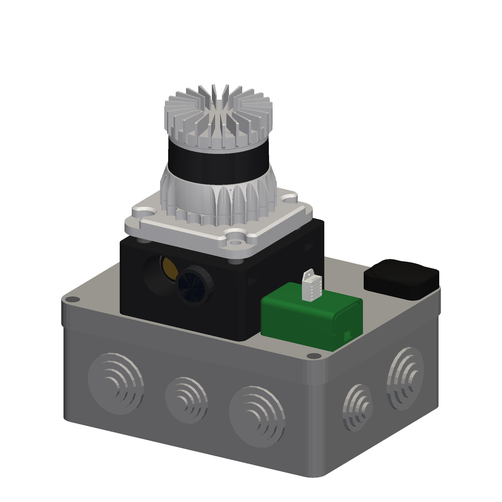
</p>

Hardware setup and launch infrastructure for the **HITOS** (Heterogeneous Integrated Thermal-Optical System) on-board computer — a self-contained sensor payload on a Raspberry Pi 5 OBC integrating a visible camera, a thermal camera, a 3D LiDAR, a GNSS receiver, a temperature/humidity sensor and a storage drive, all managed via ROS 2 and a web dashboard.

## At a glance

|  |  |
|---|---|
| **What** | RPi 5 payload — Basler RGB + FLIR LWIR + Ouster OS0-128 + u-blox GPS + DHT22 → time-synchronized, FOV-cropped datasets |
| **Run** | [`hitos_*` systemd services](#first-time-deployment); or manual via [`hitos_ros_setup` + the F5–F9 hotkeys](#environment) |
| **Data** | `/media/arvc/DATASETS/images_eeha/{mult,calib}_<DD-MM-YYYY_HHhMMm>/` — per-sensor subfolders + `tf_static.yaml` |
| **Control** | [web dashboard `http://<host>:5050`](#web-guis) · camera GUI `:5051` |
| **Networks** | [sensor bus `eth0` 192.168.4.0/24](#network-topology) (cameras + LiDAR) · internet via USB-Ethernet · WiFi hotspot for field control |

## Contents

- **Platform & hardware** — [hardware](#hardware-components) · [network topology](#network-topology) · [power budget](#power-budget)
- **How it works** — [architecture (ROS 2 dataflow)](#architecture) · [sensor model & TF frames](#sensor-model-and-tf-frames) · [timestamp synchronization](#timestamp-synchronization)
- **Setup & operation** — [dependencies](#dependencies) · [first-time deployment](#first-time-deployment) · [network config](#network-configuration) · [building](#building) · [environment](#environment) · [web GUIs](#web-guis)
- **Reference** — [sensor IPs & ports](#sensor-ips-and-ports) · [log management](#log-management)
- **[Known issues](#known-issues)**

---

## Platform

### Hardware components

| Component | Model | Interface | Address / Port |
|-----------|-------|-----------|----------------|
| OBC | Raspberry Pi 5 (8 GB) | — | `eth0: 192.168.4.1` |
| Visible camera | Basler ACA 1600-60gc | GigE Vision · PoE (802.3af) | `192.168.4.5` |
| LWIR camera | FLIR A68 | GigE Vision · PoE (802.3af) | `192.168.4.6` |
| 3D LiDAR | Ouster OS0-128 Rev. U | GigE · dedicated 24 V / 1.5 A PSU | `192.168.4.4` |
| GNSS receiver | u-blox 7 | USB (CDC-ACM) | `/dev/ublox_gps` (udev symlink, see Known Issues) |
| Temperature sensor | DHT22 via NodeMCU ESP8266 | USB–serial (CH340) | `/dev/ttyUSB0` (auto-detected) |
| Storage | External HDD | USB 3.0 | `/media/arvc/DATASETS` |

All sensors except the HDD are physically integrated inside the HITOS enclosure. The GNSS antenna and the Ouster are mounted on the exterior of the vehicle; the cameras face forward through an acrylic window.

### Network topology

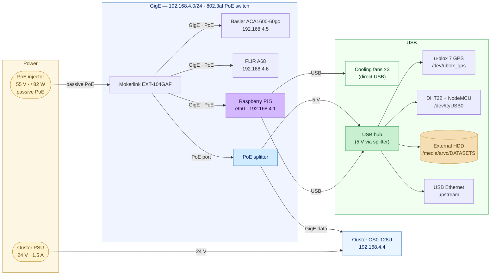
```mermaid
flowchart LR
    subgraph PWR["Power"]
        INJ(["PoE injector\n55 V · ≈82 W\npassive PoE"])
        PSU(["Ouster PSU\n24 V · 1.5 A"])
    end

    subgraph POE["GigE — 192.168.4.0/24  ·  802.3af PoE switch"]
        SWITCH["Mokerlink EXT-104GAF"]
        BASLER["Basler ACA1600-60gc\n192.168.4.5"]
        FLIR["FLIR A68\n192.168.4.6"]
        RPI["Raspberry Pi 5\neth0 · 192.168.4.1"]
        SPLIT["PoE splitter"]
    end

    OUSTER["Ouster OS0-128U\n192.168.4.4"]

    subgraph USB_GRP["USB"]
        FANS["Cooling fans ×3\n(direct USB)"]
        HUB["USB hub\n(5 V via splitter)"]
        GPS["u-blox 7 GPS\n/dev/ublox_gps"]
        DHT["DHT22 + NodeMCU\n/dev/ttyUSB0"]
        HDD[("External HDD\n/media/arvc/DATASETS")]
        ETH["USB Ethernet\nupstream"]
    end

    INJ    -->|passive PoE| SWITCH
    SWITCH -->|GigE · PoE| BASLER
    SWITCH -->|GigE · PoE| FLIR
    SWITCH -->|GigE · PoE| RPI
    SWITCH -->|PoE port| SPLIT
    SPLIT  -->|GigE data| OUSTER
    PSU    -->|24 V| OUSTER
    SPLIT  -->|5 V| HUB
    RPI    -->|USB| HUB
    HUB    --> GPS
    HUB    --> DHT
    HUB    --> HDD
    HUB    --> ETH
    RPI    -->|USB| FANS

    style PWR     fill:#fdf6e3,stroke:#c8a050,color:#5a4010
    style POE     fill:#f0f4ff,stroke:#4080c0,color:#002060
    style USB_GRP fill:#f0fff0,stroke:#40a060,color:#003010
    style INJ     fill:#fff3cd,stroke:#c8a050,color:#5a4010
    style PSU     fill:#fff3cd,stroke:#c8a050,color:#5a4010
    style RPI     fill:#d4b8ff,stroke:#8860d0,color:#1a0a3c
    style SPLIT   fill:#d0eaff,stroke:#4080c0,color:#002060
    style OUSTER  fill:#e8f4ff,stroke:#4080c0,color:#002060
    style HUB     fill:#c8f0d0,stroke:#40a060,color:#003010
    style HDD     fill:#f5deb3,stroke:#c8a050,color:#5a4010
    style FANS    fill:#f0fff0,stroke:#40a060,color:#003010
```

The PoE injector powers the switch via the passive PoE uplink port. The switch distributes PoE 802.3af to the cameras and RPi 5. One switch port feeds a PoE splitter: its 5 V output powers the USB hub; its Ethernet data port connects to the Ouster, providing the link-up signal that keeps the splitter port alive (see Known Issues). The Ouster is powered independently by a dedicated 24 V / 1.5 A PSU. RPi `eth0` is statically configured at `192.168.4.1/24`.

> **Recommended:** configure the Ouster with a static IP in the `192.168.4.x` range via the REST API (the web UI does not expose IP settings). Connect the sensor directly to a host while it still has its link-local IP and run:
> ```bash
> curl -i -X PUT http://169.254.46.138/api/v1/system/network/ipv4/override \
>   -H "Content-Type: application/json" --data-raw '"192.168.4.4/24"'
> curl -X POST http://169.254.46.138/api/v1/system/reboot
> ```
> `ouster_params.yaml` and `hitos_private_functions.sh` already default to `192.168.4.4`. Once the sensor is reconfigured the link-local route is no longer needed.

### Power budget

The passive PoE injector (55 V / 1.5 A ≈ 82 W) feeds the switch. The Ouster is off the PoE budget entirely — it has its own 24 V / 1.5 A PSU.

| Device | Power source | Typical draw |
|--------|-------------|-------------|
| Switch overhead | PoE injector | ~3 W |
| Raspberry Pi 5 (normal load) | PoE switch (802.3af) | ~10–15 W |
| FLIR A68 | PoE switch (802.3af) | ~8–10 W |
| Basler ACA 1600-60gc | PoE switch (802.3af) | ~3.5 W |
| USB hub + peripherals | PoE splitter (5 V) | ~3–5 W |
| **Switch PoE total** | PoE injector | **~28–37 W** |
| Ouster OS0-128U | Dedicated 24 V PSU | ~15–20 W |

The 82 W injector has comfortable headroom. The Ouster PSU is sized at 36 W (24 V × 1.5 A), also with headroom.

---

## Architecture

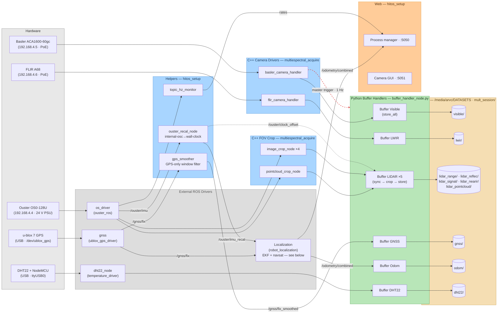
```mermaid
flowchart LR
    subgraph HW["Hardware"]
        OUSTER["Ouster OS0-128U<br/>(192.168.4.4 · 24 V PSU)"]
        BASLER["Basler ACA1600-60gc<br/>(192.168.4.5 · PoE)"]
        FLIR_CAM["FLIR A68<br/>(192.168.4.6 · PoE)"]
        GPS_HW["u-blox 7 GPS<br/>(USB · /dev/ublox_gps)"]
        DHT_HW["DHT22 + NodeMCU<br/>(USB · ttyUSB0)"]
    end

    subgraph EXT["External ROS Drivers"]
        DRV_LID["os_driver<br/>(ouster_ros)"]
        DRV_GPS["gnss<br/>(ublox_gps_driver)"]
        DHT_NODE["dht22_node<br/>(temperature_driver)"]
        LOC["Localization<br/>(robot_localization)<br/>EKF + navsat — see below"]
    end

    subgraph CAM_DRV["C++ Camera Drivers — multiespectral_acquire"]
        DRV_VIS["basler_camera_handler"]
        DRV_LWIR["flir_camera_handler"]
    end

    subgraph CROP["C++ FOV Crop — multiespectral_acquire"]
        PC_CROP["pointcloud_crop_node"]
        IMG_CROP["image_crop_node ×4"]
    end

    subgraph BUF["Python Buffer Handlers — buffer_handler_node.py"]
        B_VIS["Buffer Visible<br/>(store_all)"]
        B_LWIR["Buffer LWIR"]
        B_LIDAR["Buffer LIDAR ×5<br/>(sync → crop → store)"]
        B_GNSS["Buffer GNSS"]
        B_ODO["Buffer Odom"]
        B_DHT["Buffer DHT22"]
    end

    subgraph DISK["Disk — /media/arvc/DATASETS · mult_session/"]
        D_VIS[("visible/")]
        D_LWIR[("lwir/")]
        D_LIDAR[("lidar_range/ · lidar_reflec/<br/>lidar_signal/ · lidar_nearir/<br/>lidar_pointcloud/")]
        D_GNSS[("gnss/")]
        D_ODO[("odom/")]
        D_DHT[("dht22/")]
    end

    subgraph CTRL["Web — hitos_setup"]
        WM["Process manager · :5050"]
        GUI_CAM["Camera GUI · :5051"]
    end

    subgraph HELP["Helpers — hitos_setup"]
        RECAL["ouster_recal_node<br/>internal-osc→wall-clock"]
        HZ["topic_hz_monitor"]
        SMOOTH["gps_smoother<br/>GPS-only window filter"]
    end

    OUSTER --> DRV_LID
    BASLER --> DRV_VIS
    FLIR_CAM --> DRV_LWIR
    GPS_HW --> DRV_GPS
    DHT_HW --> DHT_NODE

    DRV_LID --> PC_CROP & IMG_CROP
    DRV_LID -->|/ouster/imu| RECAL

    DRV_VIS --> B_VIS
    DRV_LWIR --> B_LWIR
    PC_CROP & IMG_CROP --> B_LIDAR
    DRV_GPS -->|/gnss/fix| SMOOTH
    DRV_GPS -->|/gnss/fix| LOC
    LOC -->|/odometry/combined| B_ODO
    DHT_NODE --> B_DHT
    LOC -->|/odometry/combined| WM

    DRV_VIS -.->|master trigger · 1 Hz| BUF

    B_VIS --> D_VIS
    B_LWIR --> D_LWIR
    B_LIDAR --> D_LIDAR
    B_GNSS --> D_GNSS
    B_ODO --> D_ODO
    B_DHT --> D_DHT

    RECAL -->|/ouster/imu_recal| LOC
    RECAL -.->|/ouster/clock_offset| B_LIDAR
    DRV_LID --> HZ
    HZ -->|rates| WM
    SMOOTH -->|/gnss/fix_smoothed| B_GNSS

    style HW      fill:#e8e8e8,stroke:#888,color:#333
    style EXT     fill:#ddd,stroke:#999,color:#555
    style CAM_DRV fill:#a8d5ff,stroke:#4a90d9,color:#1a3a5c
    style CROP    fill:#a8d5ff,stroke:#4a90d9,color:#1a3a5c
    style BUF     fill:#b8e6b8,stroke:#5aa55a,color:#1a3a1a
    style CTRL    fill:#ffcc99,stroke:#e6a040,color:#5a3510
    style HELP    fill:#a8d5ff,stroke:#4a90d9,color:#1a3a5c
    style DISK    fill:#f5deb3,stroke:#c8a050,color:#5a4010

    linkStyle 17 stroke:#e05050,stroke-width:2,stroke-dasharray:5
```

**Localization (EKF) chain** — expansion of the `Localization` box above (all `robot_localization`):


```mermaid
flowchart LR
    IMU(["/ouster/imu_recal<br/>(ouster_recal_node)"])
    FIX(["/gnss/fix<br/>(gnss)"])
    EKF1["ekf_local"]
    NAVSAT["navsat_transform"]
    EKF2["ekf_global"]
    OUT(["/odometry/combined<br/>→ Buffer Odom · web manager"])

    IMU --> EKF1
    FIX --> NAVSAT
    EKF1 -->|/odometry/filtered| NAVSAT
    EKF1 -->|/odometry/filtered| EKF2
    NAVSAT -->|/odometry/gnss| EKF2
    EKF2 --> OUT

    style EKF1 fill:#ddd,stroke:#999,color:#333
    style NAVSAT fill:#ddd,stroke:#999,color:#333
    style EKF2 fill:#ddd,stroke:#999,color:#333
```

**Legend:** <span style="color:#4a90d9">blue</span> = internal C++ nodes · <span style="color:#5aa55a">green</span> = Python buffers · <span style="color:#e6a040">orange</span> = web GUIs · <span style="color:#c8a050">tan</span> = disk · gray = hardware / external packages · <span style="color:#e05050">red dashed</span> = master trigger

**Localization chain:** the entire pipeline depends on the Ouster IMU. `ekf_local` consumes `/ouster/imu_recal` (the IMU restamped to wall-clock by `ouster_recal_node`; the raw `TIME_FROM_INTERNAL_OSC` stamps are sensor uptime and would be rejected). If the Ouster is unreachable, EKF local never produces `/odometry/filtered`, navsat_transform never initialises, and EKF global produces nothing. Buffer Odom uses `/odometry/combined` (GPS-fused) from EKF global. The same `ouster_recal_node` feeds `/ouster/clock_offset` to the LiDAR buffer handlers so the cloud/images land on wall-clock for camera matching. See "Timestamp synchronization".

## Sensor model and TF frames

The static sensor TFs come from a single URDF/xacro, `urdf/hitos_sensors.urdf.xacro`, loaded by `launch/sensor_model.launch.py` (which `sensors.launch.py` includes, so it runs inside `hitos_sensors.service`). It needs the `xacro` package and replaced the old `static_transform_publisher` script. Run it alone + rviz (Fixed Frame `ip55_box`, add RobotModel + TF) to inspect the rig.

Frame tree (all fixed joints):

```
base_link
└─ ip55_box                       IP55 enclosure (232×182×95 mm); everything sits on its lid
   ├─ multiespectral_base         camera-mount bottom-centre (on the lid, +velcro)
   │  ├─ multiespectral_center / multiespectral_top
   │  │                           └─ os_sensor      → driver adds os_lidar / os_imu (metadata)
   │  └─ multiespectral_focal_base
   │     ├─ visible_camera_frame  → visible_camera_optical_frame
   │     └─ lwir_camera_frame     → lwir_camera_optical_frame
   └─ gps_link                    GPS antenna (lid, +velcro)
```

`temp_box` + `dht22` (temp/humidity enclosure) are visual-only — no calibration frame.

**These numbers are a SEED from the CAD, not a measured extrinsic** — an initial estimate for the LiDAR↔camera calibration to refine. Translations are taken exactly from the mount CAD; the IP55-box / GPS / temp-box placement from on-rig measurements (the three lid items sit on ~2 mm velcro pads, included in the joint offsets). The `os_sensor` yaw is pinned to 0 by the rear-facing connector + the forward crop window (see the xacro comment); `OUSTER_BASE_Z` ≈ 0.015 and `base_link→ip55_box` (vehicle mount) remain the main TODOs.

**Meshes** (`meshes/`, referenced by the xacro; URDF accepts STL/DAE/OBJ, **not** STEP): `camera_pair_paralel_v2.stl` (mount bracket) and the camera bodies are exported from the mount CAD; `ouster_exterior.stl` is the OS1-exterior (noFOV) mesh — same housing as the OS0-128; `nodemcu_dht22_box.stl` + `dht22.stl` are the temp/humidity enclosure. The GPS (VK-162) and the optical-window two-tone of the Ouster are drawn by the render script (below); rviz shows the meshes with the flat `<material>` colours from the xacro.

**Renders** — regenerate with `xvfb-run -a python3 scripts/render_model_vtk.py` (VTK off-screen → transparent PNGs in `media/`; a no-xvfb matplotlib fallback lives in `scripts/render_model.py`). In the FOV rows, each sensor's field of view is colour-coded: **Basler blue, FLIR red, Ouster-crop green**.

<table>
<tr><th align="center">Solid</th><th align="center">Translucent + frames</th><th align="center">Frames only</th></tr>
<tr>
  <td></td>
  <td>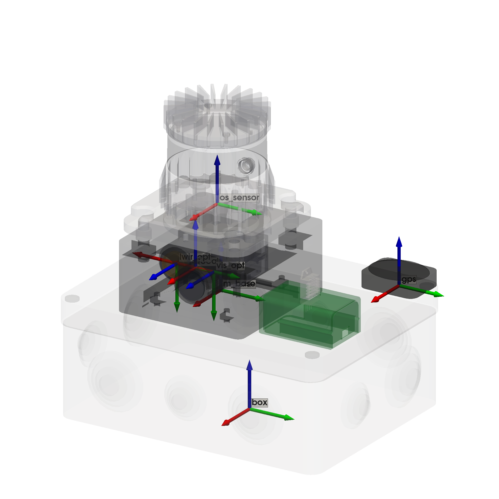</td>
  <td>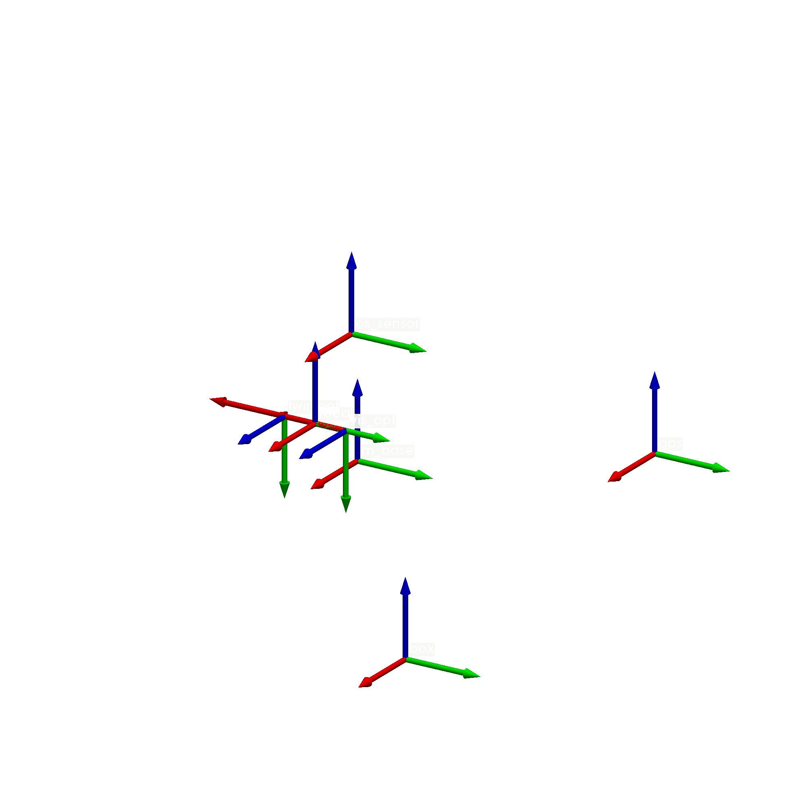</td>
</tr>
<tr><th align="center" colspan="3">Front view (head-on)</th></tr>
<tr>
  <td>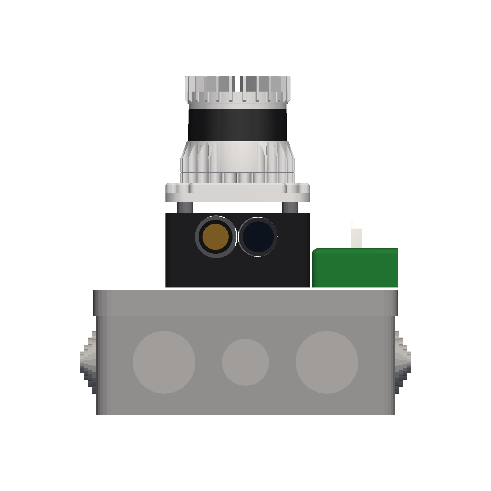</td>
  <td>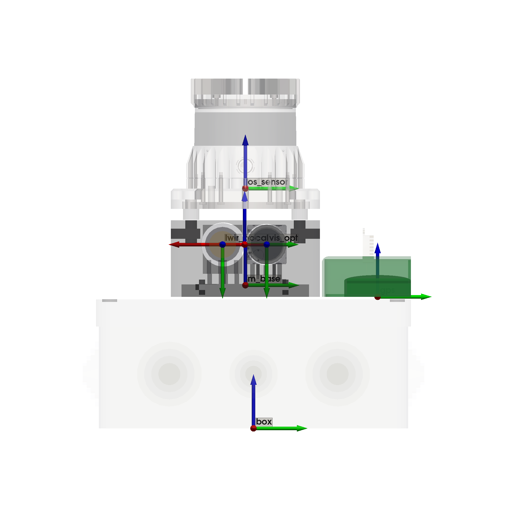</td>
  <td>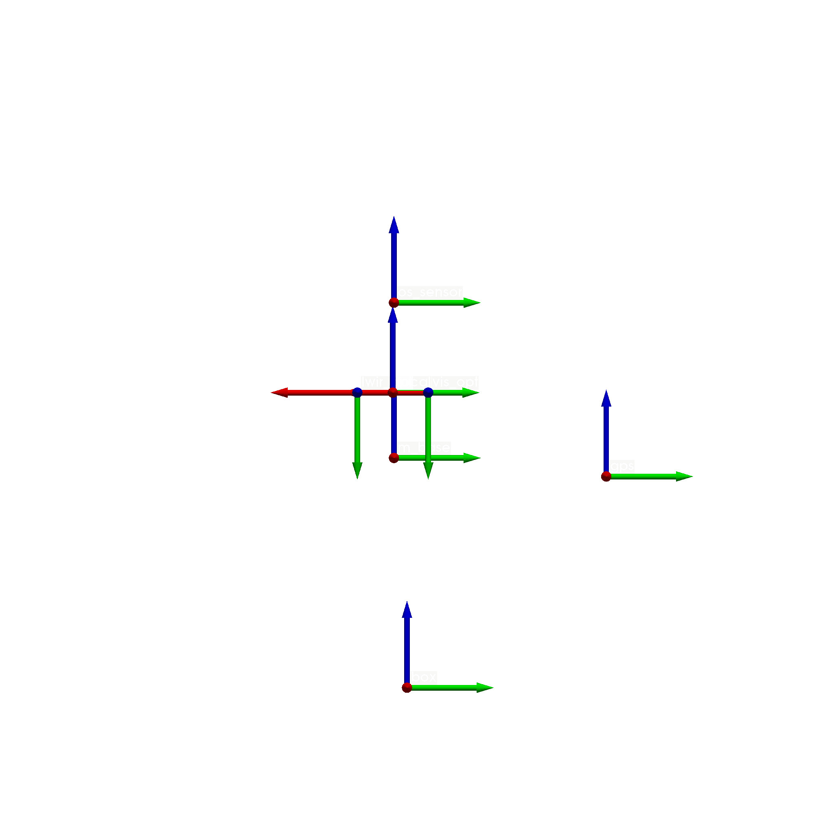</td>
</tr>
<tr><th align="center" colspan="3">+ FOV (Basler · FLIR · Ouster crop)</th></tr>
<tr>
  <td>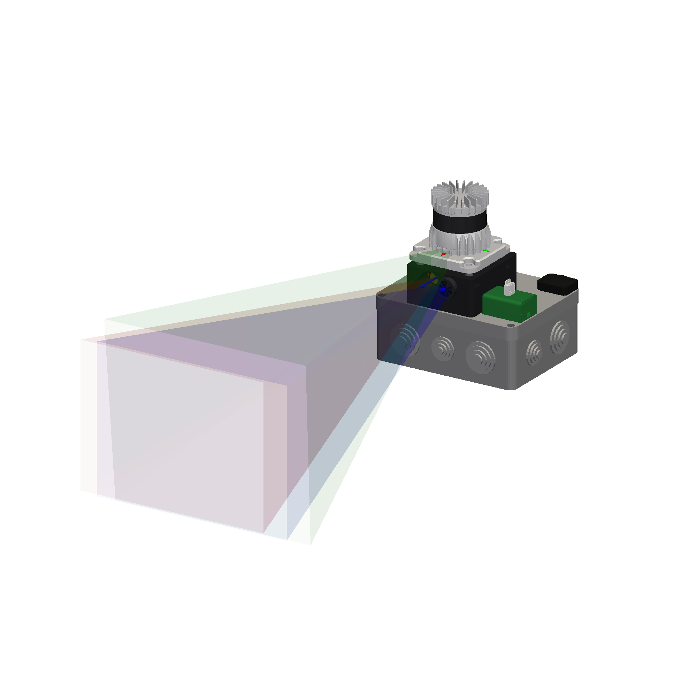</td>
  <td>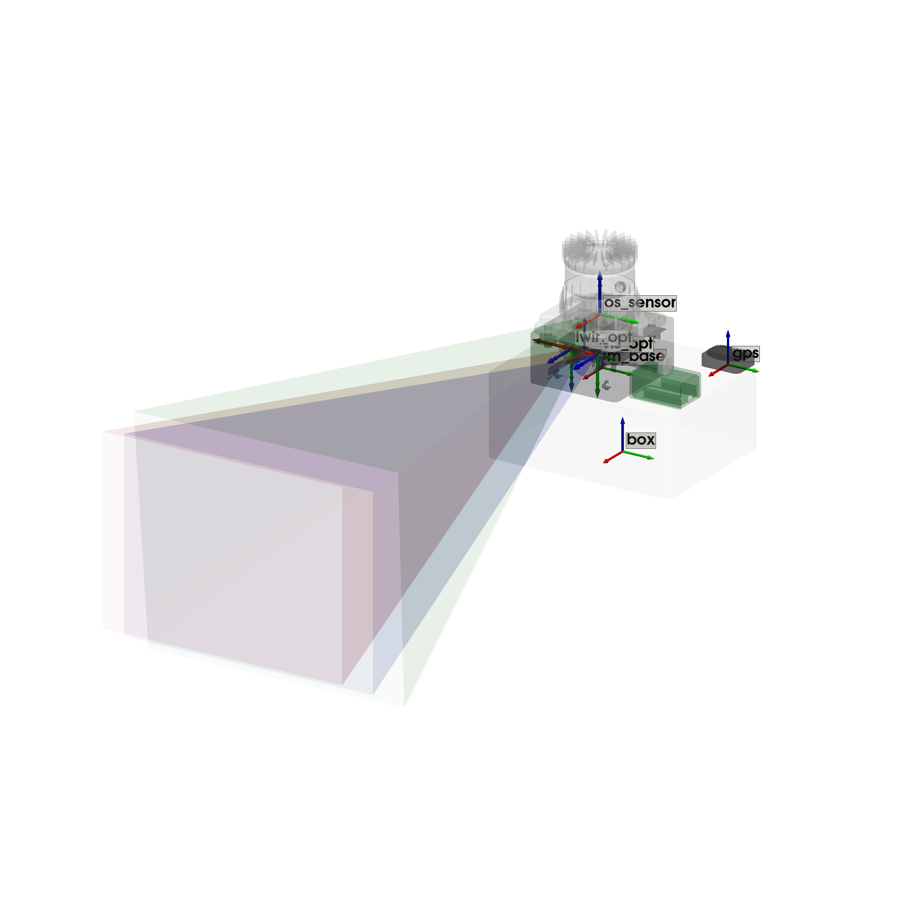</td>
  <td>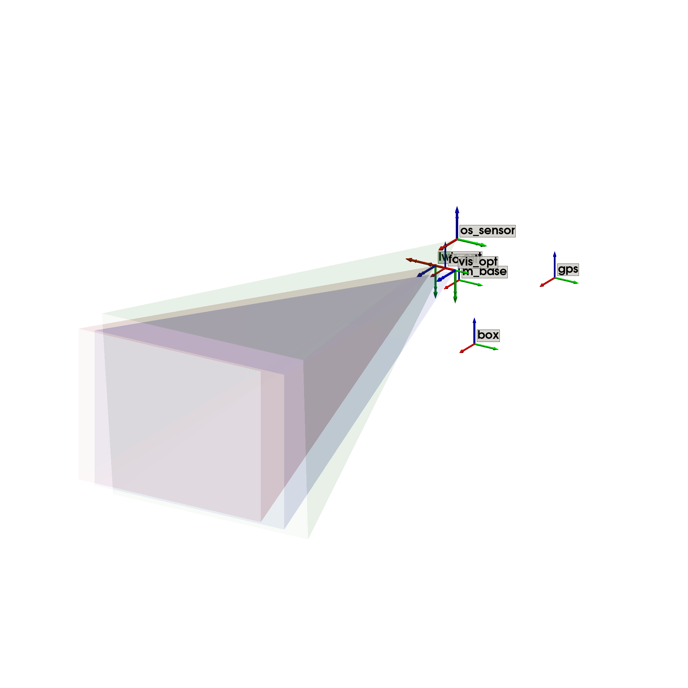</td>
</tr>
</table>

## Timestamp synchronization

_Mapping every sensor clock onto the RPi wall-clock (`CLOCK_REALTIME`)._

All stored data must share **one timescale** so the buffer compositor can match each
camera trigger to the nearest LiDAR scan / GNSS fix / etc. That timescale is the
RPi's `CLOCK_REALTIME` (wall-clock). How each sensor gets there:

| Sensor | Clock | How it reaches wall-clock |
|--------|-------|---------------------------|
| Basler (visible, trigger) | camera crystal | software `TimestampCalibration` (we control the software trigger → low-latency reference) |
| FLIR A68 (LWIR) | camera crystal | software `TimestampCalibration` (free-runs at 30 Hz; calibrated from frame arrival) |
| Ouster (points, images, IMU) | sensor internal oscillator | `ouster_recal_node` (see below) |
| GNSS, DHT22 | — | already stamped in system time by their drivers |

### Why not PTP (and what the RPi 5 master actually does)

The intended design was IEEE-1588 PTP: `hitos_ptp.service` (ptp4l) as grandmaster on
`eth0`, `hitos_ptp_sync.service` (phc2sys) disciplining the NIC PHC to TAI, and the
Ouster + FLIR slaving to it. **The RPi 5 master is verified-perfect** (pcap analysis
2026-06-15: Sync/Follow-Up/Delay-Resp timestamps are exactly capture-time + 37 s = TAI,
correction field 0; `phc2sys` holds the PHC to ±100 ns). The RP1 NIC supports hardware
timestamping (`ethtool -T eth0` → hardware-tx/rx, `/dev/ptp0`).

**But neither slave locks.** The Ouster's PTP servo reports a persistent *negative*
`mean_path_delay` (~−2 s) and bounces ±5 s; the FLIR A68 stays in `Synchronizing` and
never reaches `Locked`. Both slaves fail behind the **Mokerlink EXT-104GAF switch**
while image data flows fine — pointing at the switch's PTP handling (it is not a
transparent clock) or a per-sensor/firmware issue, **not** the RPi. It worked on the
Husky; the discriminating on-site test is to connect the Ouster directly to the Pi's
`eth0` (bypass the switch). Until then PTP is not usable for the Ouster.

> Note: the RPi 5 has **no battery-backed RTC** — it boots at 1970 and NTP corrects the
> clock seconds later. `hitos_ptp_sync` starts before `hitos_ptp` (dependency reversed
> 2026-06-15) and both wait for NTP, so the master only ever announces an NTP-correct
> clock. This avoids slaves locking onto a wrong boot clock and then slewing the
> correction — but does not fix the switch-level PTP failure above.

### Ouster workaround: IMU-calibrated internal oscillator

With PTP unusable, the Ouster runs `timestamp_mode: TIME_FROM_INTERNAL_OSC` — a stable
free-running crystal shared by **all** its outputs (points, images, IMU). `ouster_recal_node`
(C++, `hitos_setup/src/`, launched by `lidar.launch.py`) maps that clock to wall-clock:

- Subscribes `/ouster/imu` (100 Hz). The IMU is the ideal calibration source: high-rate
  (stable EMA), tiny (lowest transfer latency → offset ≈ true clock offset), and on the
  same clock as the cloud.
- `offset = EMA(now_wall − internal_stamp)` (integer EMA, ~1 s window).
- Publishes `/ouster/imu_recal` (IMU restamped to wall-clock — verified ±1 ms — consumed
  by `ekf_local`, since raw uptime stamps would be rejected) and `/ouster/clock_offset`
  (`std_msgs/Float64`, RELIABLE + TRANSIENT_LOCAL).

The buffer compositor's Ouster handlers apply that offset via the **generic**
`clock_offset_topic` parameter (see `multiespectral_acquire`) — the compositor logic
stays sensor-agnostic; only the handler config wires `/ouster/clock_offset` to the five
Ouster sync handlers. Result (verified 2026-06-15): `ouster/points_sync` and the image
`_sync` topics match the 1 Hz camera trigger.

**Precision**: relative timing is exact (shared crystal); the absolute anchor carries the
IMU's (sub-ms) transfer latency. Good for dataset-level fusion, not the ns of true PTP.
If PTP is ever fixed (switch bypass), revert `timestamp_mode` to `TIME_FROM_PTP_1588`,
`ekf_local imu0` to `/ouster/imu`, and drop `clock_offset_topic` from the handler config.

### New helper nodes / services (2026-06-15)

- `ouster_recal_node` (C++) — internal-osc → wall-clock, above.
- `topic_hz_monitor` (C++) — publishes `<topic>/hz` (`std_msgs/Float64`) for high-rate
  topics so the Python web manager reads rates from tiny topics instead of subscribing to
  the firehose (cut the web manager from 60 % to ~5 % CPU). Service `hitos_hz_monitor`.
- `gps_smoother_node.py` (launched by `gps.launch.py`) — the dataset is stored at the ~1 Hz
  trigger but the u-blox runs at 5 Hz, so most fixes would be discarded. This node refines
  `/gnss/fix` into `/gnss/fix_smoothed` (`NavSatFix`) using a **sliding-window linear fit
  evaluated at the latest instant** — pure GPS, **no IMU** (unlike navsat's `/gps/filtered`,
  which is the IMU-fused EKF state and not useful on a hand-carried rig with gyro-only heading).
  The fit (not a plain mean) avoids smearing while walking; the window adapts to the fitted
  speed; covariance is reduced toward 1/N but floored (GPS error is temporally correlated).
  No-fix messages (huge covariance) are rejected. `hitos_sync.service` points the GNSS buffer
  at `/gnss/fix_smoothed`. The raw `/gnss/fix` still feeds navsat for the EKF.
- `hitos_sync.service` — buffer compositor + LiDAR crop, split from `hitos_cameras`
  (cameras only). `PartOf=hitos_cameras` (camera restart → sync restart); session shared
  via `/tmp/hitos_session.env`.


## Dependencies

| Package | Repository | Role |
|---------|-----------|------|
| `ouster_ros` | [ouster-lidar/ouster-ros](https://github.com/ouster-lidar/ouster-ros) | Ouster LiDAR driver |
| `ublox_gps_driver` | [KumarRobotics/ublox](https://github.com/KumarRobotics/ublox) | u-blox GPS driver |
| `robot_localization` | [cra-ros-pkg/robot_localization](https://github.com/cra-ros-pkg/robot_localization) | EKF sensor fusion + navsat_transform |
| `multiespectral_acquire` | [enheragu/multiespectral_acquire](https://github.com/enheragu/multiespectral_acquire) | Camera drivers, crop nodes, acquisition pipeline; the web GUI lives in its companion `multiespectral_acquire_gui` package |

---

## First-time deployment

After cloning and building the workspace, run the one-time system setup script **once as root**:

```bash
sudo bash src/hitos_setup/systemctl_services/setup_system_limits.sh
```

This installs:
- Journald and rsyslog size/rotation limits (prevents log spam from filling the SD card).
- Sudoers rules for passwordless service control from the web manager.

Then symlink and enable the systemd services:

```bash
cd src/hitos_setup/systemctl_services

sudo ln -sf $(pwd)/hitos_iptables.service      /etc/systemd/system/
sudo ln -sf $(pwd)/hitos_ptp.service           /etc/systemd/system/
sudo ln -sf $(pwd)/hitos_ptp_sync.service      /etc/systemd/system/
sudo ln -sf $(pwd)/hitos_sensors.service       /etc/systemd/system/
sudo ln -sf $(pwd)/hitos_cameras.service       /etc/systemd/system/
sudo ln -sf $(pwd)/hitos_sync.service          /etc/systemd/system/
sudo ln -sf $(pwd)/hitos_camera_gui.service    /etc/systemd/system/
sudo ln -sf $(pwd)/hitos_web_manager.service   /etc/systemd/system/
sudo ln -sf $(pwd)/hitos_log_cleanup.service   /etc/systemd/system/
sudo ln -sf $(pwd)/hitos_log_cleanup.timer     /etc/systemd/system/

sudo systemctl daemon-reload
sudo systemctl enable --now hitos_iptables hitos_ptp hitos_ptp_sync \
    hitos_sensors hitos_cameras hitos_sync hitos_camera_gui hitos_web_manager \
    hitos_log_cleanup.timer
```

**Camera/sync service split** — `hitos_cameras.service` runs only the two camera
drivers (`cameras_only.launch.py`); `hitos_sync.service` runs the lidar crop
nodes and the buffer compositor (`capture_sync.launch.py`). The session folder
is generated by `hitos_cameras` and shared through `/tmp/hitos_session.env`.
`hitos_sync` has `PartOf=hitos_cameras.service`, so restarting the cameras also
restarts the sync side (new session), while `hitos_sync` can be restarted alone
without interrupting the cameras. Starting them in order also staggers the
CPU/RAM peaks of Pylon/Spinnaker init and the Python compositor imports.
If you change `output_frame_rate`, change it in BOTH services (or pass it to
both launches).

**Ouster lifecycle auto-recovery** — `hitos_sensors.service` runs
`scripts/ouster_lifecycle_recover.sh` in the background after start: it waits
for the sensor HTTP API, re-drives `/ouster/os_driver` to `active` if the
boot-timing race left it `unconfigured` (the launch only tries CONFIGURE once),
and then saves the applied config to the sensor flash. Check its output with
`journalctl -u hitos_sensors | grep ouster-recover`.

**One-time Ouster flash config** — after enabling services and confirming the sensor is online, save the current config to the Ouster's internal flash. This prevents ouster_ros from reinitializing the sensor on every driver startup (slow, and it disrupts the running timing/recal):

```bash
# Verify sensor is reachable and has correct settings first
curl -s http://192.168.4.4/api/v1/sensor/config | python3 -m json.tool | grep timestamp_mode
# Should print: "timestamp_mode": "TIME_FROM_INTERNAL_OSC"  (PTP unusable — see Timestamp synchronization)

# Persist config to flash
curl -s -X POST http://192.168.4.4/api/v1/sensor/cmd/save_config_params
# Returns {} on success

# Repeat this step any time ouster_params.yaml is changed and rebuilt,
# so the driver and the sensor's stored flash config stay in sync.
```

## Network configuration

`eth0` is statically configured at `192.168.4.1/24` for the sensor network (cameras + LiDAR).

If the Ouster still has its link-local IP (`169.254.46.138`), the `hitos_iptables` service adds the required route automatically at boot via `_hitos_setup_iptables`. If the route is missing manually:

```bash
sudo ip route add 169.254.0.0/16 dev eth0
# Persistent via nmcli:
sudo nmcli connection modify multiespectral +ipv4.routes "169.254.0.0/16"
```

Once the Ouster is reconfigured to `192.168.4.4` the link-local route is no longer needed.

## Building

```bash
# In an interactive shell with hitos_ros_setup sourced:
hitos_make
```

`hitos_make` stops active ROS services, compiles with `MAKEFLAGS=-j2 --executor sequential` (memory-safe for Raspberry Pi), then restarts them. The sequential executor is needed because `ouster_ros` alone can exhaust available RAM with parallel jobs.

## Environment

Source the workspace setup from `~/.bashrc`:

```bash
source /home/arvc/ros2_ws/install/setup.bash
source /home/arvc/ros2_ws/src/hitos_setup/scripts/hitos_setup.sh
hitos_ros_setup
```

`hitos_ros_setup` detects serial ports and IPs, prints a status dashboard, and binds function keys:

| Key | Action |
|-----|--------|
| F5  | Launch GPS |
| F6  | Launch LiDAR |
| F7  | Launch temperature sensor |
| F8  | Launch multiespectral cameras |
| F9  | Launch all sensors |

## Web GUIs

| Interface | URL |
|-----------|-----|
| Process manager + topic monitor | `http://<host_ip>:5050` |
| Camera GUI | `http://<host_ip>:5051` |

### Web Manager screenshots (port 5050)

<table>
<tr>
  <th align="center">Light theme</th>
  <th align="center">Dark theme</th>
</tr>
<tr>
  <td>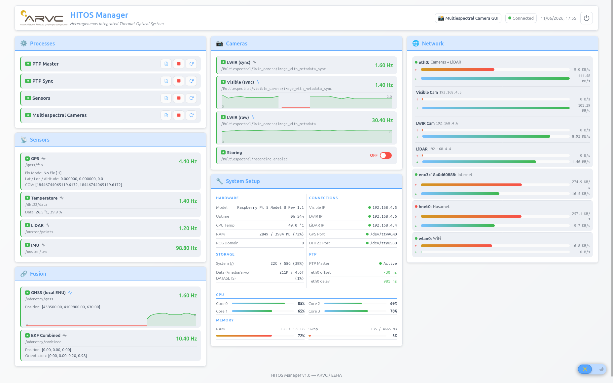</td>
  <td>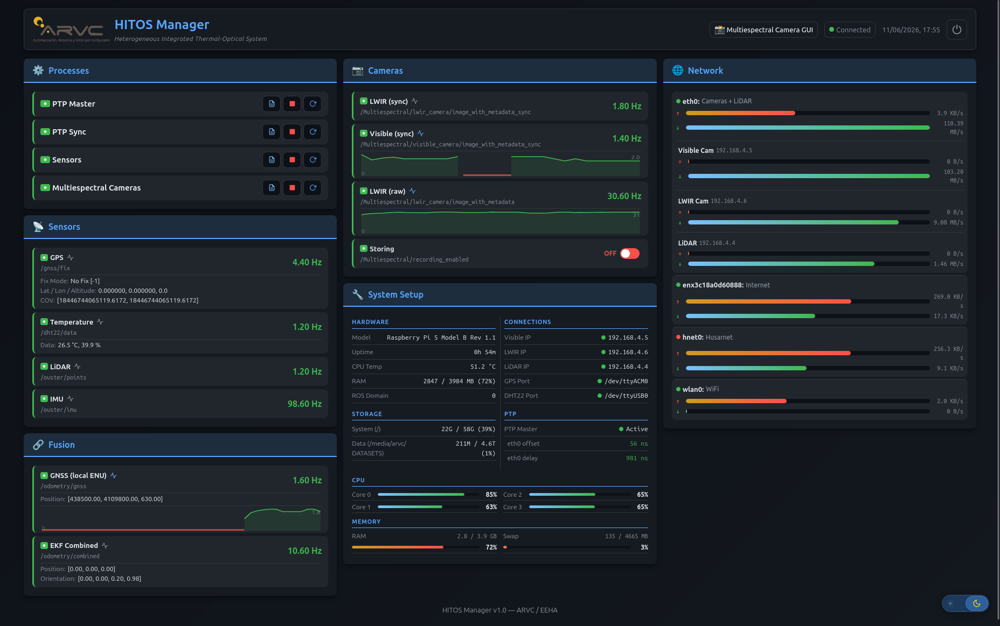</td>
</tr>
<tr>
  <td>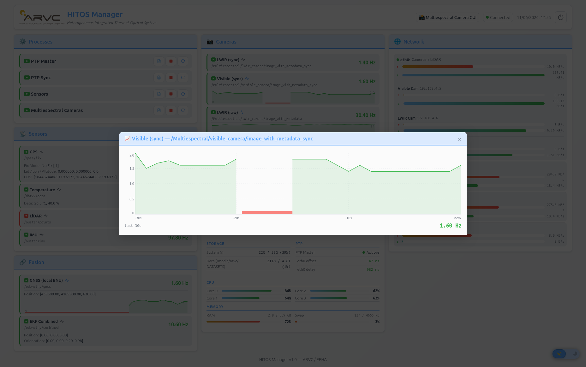</td>
  <td>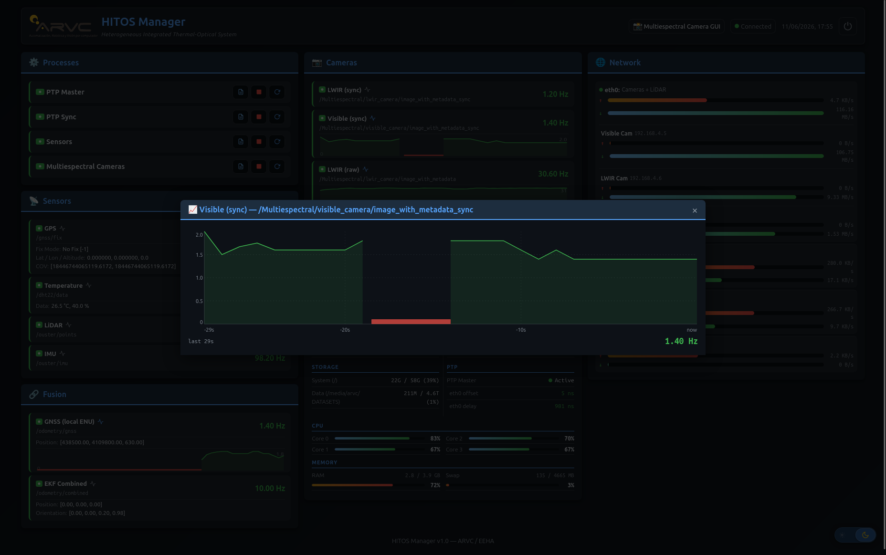</td>
</tr>
<tr>
  <td align="center" colspan="2"><em>↑ plot panel expanded (bottom row)</em></td>
</tr>
</table>

<details>
<summary><strong>Mobile screenshots</strong> (scroll views, click to expand)</summary>
<br>

<table>
<tr>
  <th colspan="5" align="center">Light theme</th>
</tr>
<tr>
  <td>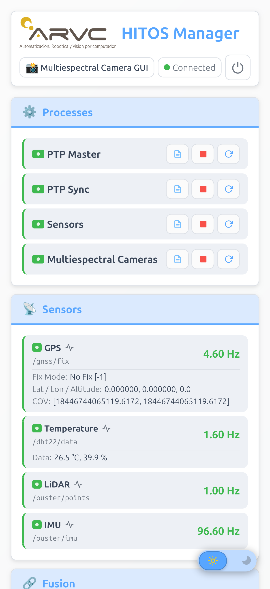</td>
  <td>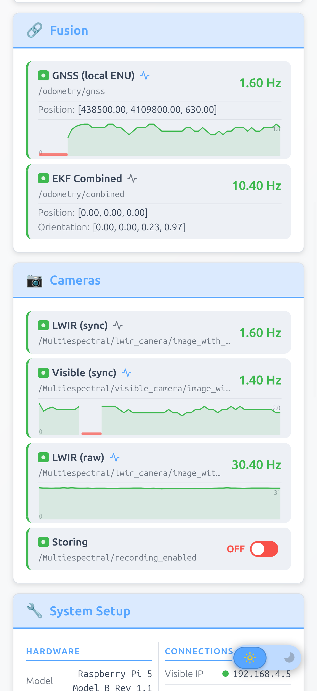</td>
  <td>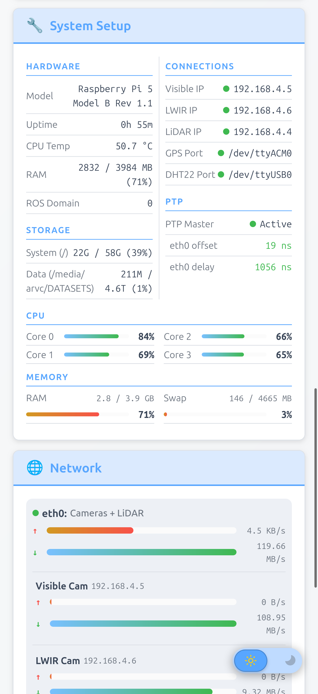</td>
  <td>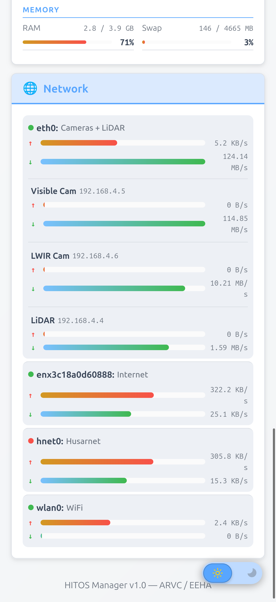</td>
  <td>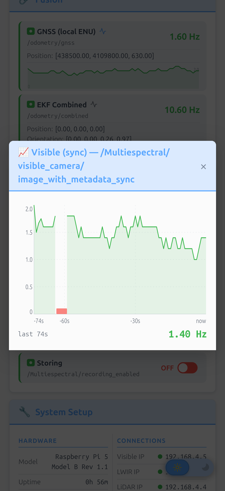</td>
</tr>
<tr>
  <th colspan="5" align="center">Dark theme</th>
</tr>
<tr>
  <td>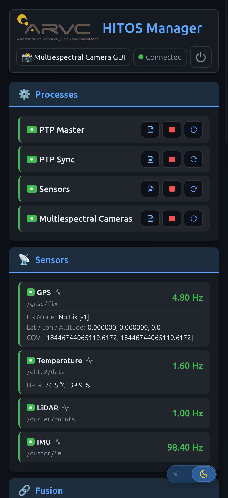</td>
  <td>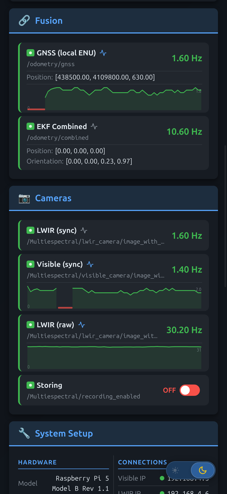</td>
  <td>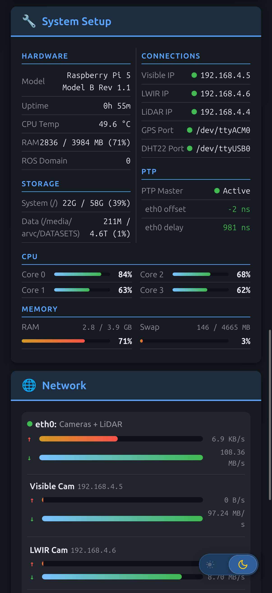</td>
  <td>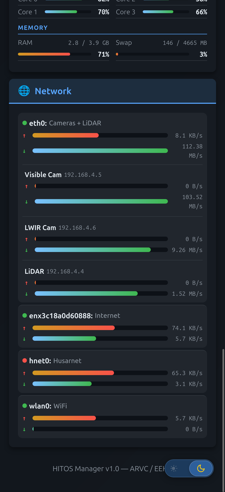</td>
  <td>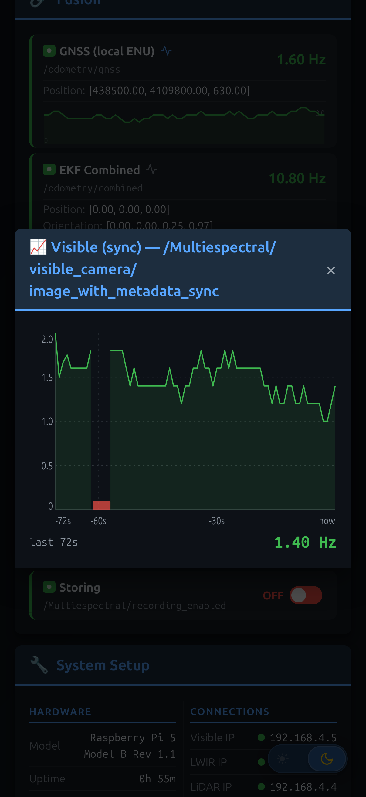</td>
</tr>
</table>

</details>

## Sensor IPs and ports

| Sensor | Address | Notes |
|--------|---------|-------|
| Visible camera (Basler) | `192.168.4.5` | GigE Vision, PoE switch |
| LWIR camera (FLIR) | `192.168.4.6` | GigE Vision, PoE switch |
| LiDAR (Ouster) | `192.168.4.4` | Static IP (recommended); see Platform section for reconfiguration steps |
| GPS (u-blox 7) | `/dev/ublox_gps` | Persistent udev symlink (`/etc/udev/rules.d/99-ublox-gps.rules`); raw device is `/dev/ttyACM0` or `/dev/ttyACM1` depending on enumeration order |
| Temperature (DHT22) | `/dev/ttyUSB0` | CH340 USB-serial at 74880 baud |

## Log management

Logs are limited by `setup_system_limits.sh`:
- **journald**: 500 MB max, 2-week retention, rate limit 300 msg/30s per service.
- **syslog**: daily rotation, 7 days, 100 MB max per file.

If syslog grows unexpectedly (e.g., a node spamming errors):

```bash
sudo truncate -s 0 /var/log/syslog
sudo journalctl --vacuum-size=200M
```

Check which service is generating the most traffic:

```bash
sudo du -sh /var/log/syslog /var/log/journal
journalctl -u hitos_sensors --since "1 hour ago" | wc -l
```

## Known issues

### Active

- **EKF chain dependency**: the entire localization pipeline (`ekf_local` → `navsat_transform` → `ekf_global`) depends on `/ouster/imu`. If the Ouster is not reachable the whole chain is silent. With no magnetometer and no wheel odometry, heading estimation relies on gyroscope integration only and will drift — a fundamental hardware limitation.
- **Ouster no returns in azimuth window**: if `/ouster/points` publishes but the point cloud is empty, check the physical orientation of the sensor housing. The current `azimuth_window_start: 152000` / `azimuth_window_end: 202000` is a 50° window re-pointed toward the camera forward (note: encoder and image-column convention are inverted — *decreasing* the window moves the valid region right). Adjust if the sensor housing is rotated.
- **Power budget**: the switch is powered via its PoE uplink using a passive 55 V / 1.5 A (≈82 W) injector — adequate for current load. If the Basler is not detected at startup under heavy load, power the RPi 5 separately via USB-C or use the switch's DC barrel jack (48 V / 2 A) as primary input instead of the PoE uplink.
- **Ouster link-local fallback**: if the sensor is factory-reset and reverts to its link-local IP (`169.254.x.x`), `hitos_iptables.service` adds the route automatically. Reconfiguring the sensor to `192.168.4.4` eliminates this.
- **Dynamic LiDAR/IMU ports**: the Ouster chooses ports dynamically. If iptables rules are missing, return UDP packets may be dropped. Verify with `sudo iptables -L HITOS_RX -v`.
- `ouster_ros` is memory-heavy to compile — `hitos_make` handles resource limits automatically.

<details>
<summary><strong>Resolved issues</strong> (fixed — expand for diagnostics if they resurface)</summary>

- **Ouster driver stuck "activating" / `rx_resource_errors` on eth0** *(fixed 2026-06-11)*: `ouster_ros` expects `azimuth_window_start` and `azimuth_window_end` as separate integers — a `azimuth_window: [...]` list is silently ignored and the sensor defaults to full 360° (~640 UDP/s). The RPi 5 GbE ring buffer (default 512 slots) overflows at that rate; the kernel discards all incoming UDP and the driver never leaves "activating". **Fix**: params corrected in `ouster_params.yaml`; `hitos_ptp.service` ExecStartPre now runs `ethtool -G eth0 rx 8192` and the sysctl settings from `ouster_ros/util/network-configure.bash` (rmem 2 GiB, netdev_max_backlog 10000, ipfrag_time 3 s, ipfrag_high_thresh 128 MiB). Diagnostic: `ethtool -S eth0 | grep rx_resource_errors` — if it climbs fast (~60 K/min) the ring is overflowing.
- **GPS USB re-enumeration** *(fixed 2026-06-10)*: after a PoE glitch the u-blox 7 can re-enumerate as `/dev/ttyACM1`, triggering an "End of file" spin-loop at ~60 % CPU that saturates journald and rsyslogd. Fix: udev symlink `/dev/ublox_gps` (rule in `/etc/udev/rules.d/99-ublox-gps.rules`). Recovery: `sudo systemctl restart hitos_sensors.service`.
- **Ouster slow init after GPS spin-loop** *(fixed 2026-06-10)*: CPU overload from the GPS spin-loop caused the Ouster to wait up to 20 min for its first packet. Root cause (GPS spin-loop) is fixed. The Ouster still takes ~30–60 s to boot after power-on plus 1–2 min for PTP sync.
- **USB hub dropout every ~175 s** *(fixed 2026-06-10, hardware)*: the PoE switch cut power to the splitter port every ~175 s when it detected no Ethernet link. Fix: splitter's Ethernet data port is now wired to the Ouster's secondary Ethernet port, keeping the link permanently up. Diagnostic: `journalctl -b 0 -k | grep over-current` (should be empty).
- **PTP PHC large initial offset** *(fixed)*: `hitos_ptp_sync.service` was setting the PHC before NTP synced, causing multi-minute PTP lock delays at boot. Fix: `ExecStartPre` now polls `timedatectl show -p NTPSynchronized` for up to 120 s before stamping.
- **RAM pressure from buffer compositor** *(fixed 2026-06-11)*: `buffer_compositor_node.py` defaulted to 100–120 items per handler; with full 360° Ouster data each PointCloud2 buffer slot was ~5 MB, reaching 1.4 GB total. Fix: per-handler configurable sizes (now 15–60 items) plus the azimuth_window fix. Current full-load RSS with VS Code open: ~2.2 GB used, ~1.7 GB available.
- **`hitos_ptp_sync.service` boot dependency** *(fixed)*: `After=time-sync.target` was ineffective on Ubuntu (systemd-timesyncd never activates that target). Fixed with the NTP polling `ExecStartPre` above.
- GPS driver logs at ERROR level on disconnect — silenced with `--log-level gnss:=WARN` in `gps.launch.py`.
- FLIR camera requires `SPINNAKER_GENTL64_CTI` — set in `/etc/profile.d/setup_spinnaker_gentl_64.sh`; cameras service exports it explicitly.

</details>
